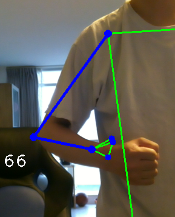

## POSE Estimation
### Summary
The script below is based on python package *mediapipe==0.8.5* - pose detection. The model can tracks the pose object that captured in the image/vedio object.

The mdeiapipe post detection return the post object in 33 dots, displaying below:

### For quick start
Use the *PoseEstimationMin.py*. The script will use the first camera device to track any POSE captured in the camera. 

### PoseModule
*PoseModule.py* defines the main class that can be reused in other applications. The class name is *poseDetector*, it contains a few basic methods. This script can also be called itself which will perform the same function as *PoseEstimationMin.py*.

### Ai Traniner
*AiTrainer.py* is a simple application that calculte the RIGHT_ARM angle based on captured POSE.

### Reference - meidapipe package
Source: https://google.github.io/mediapipe/solutions/pose